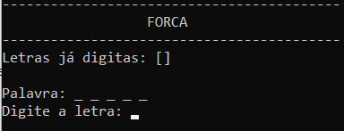
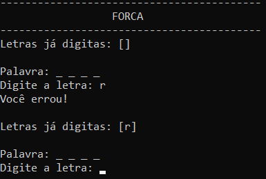
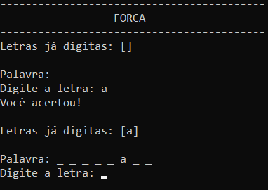
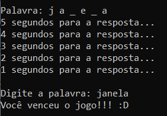

## Projeto:
Ao executar o programa com a <b>.bat</b>, é apresentada a tela inicial, onde se pode visualizar a quantidade de letras que a palavra secreta possui com os <b>'_'</b>, a digitação de uma única letra estará disponível.

   
  <b>Tela inicial</b>

Após digitado a primeira letra, e suponhando que essa letra não exista na palavra secreta, é informado que o usuário errou e essa letra digitada já é acrescentada na lista visual de letras já digitadas.

   
  <b>Tela de erro</b>

Quando o usuário acertar uma letra da palavra secreta, essa letra será adicionada ao espaço correto e também irá para a lista de letras já digitadas.

   
  <b>Tela de acerto</b>

Quando faltar duas letras para o usuário acertar a palavra, será contado 5 segundos e em seguida o usuário devera acertar todo restante da palavra, caso ele erre o mesmo processo será refeito até que ele acerte toda a palavra.

  
  <b> Tela final </b>

